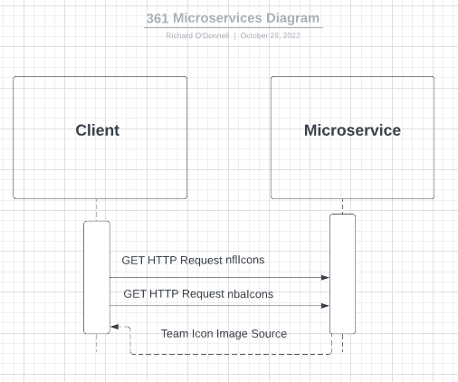

A. To request data from the microservice you must use an HTTP GET request.
For NFL teams:
ex. GET http://localhost:3000/nflIcon/raiders
For NBA teams:
ex. GET http://localhost:3000/nbaIcon/warriors

B. The data will be sent back to the requestor in the form of a
json object.

C. UML Diagram

